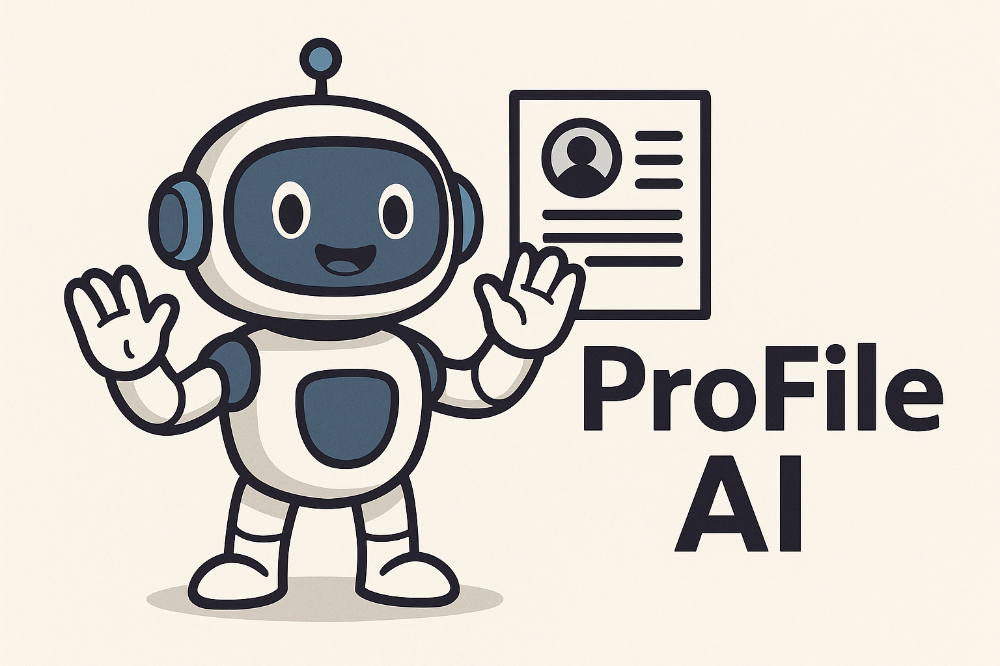

# ProFile AI
### An Interactive Professional Profile power by Agentic AI

<div style="text-align: center;">
    
</div>

This project uses the following technologies for whch you would need an account and in some cases to buy credits (or you can adapt the code to use free APIs):
* ChatGPT API - you can replace this with any other LLM API or even with [Ollama](https://ollama.com/)
* [Pushover](https://pushover.net/) a simple push notification service that has a limited free trial
* ChromaDB

The `ProfileAi` class expects at least three data sources:
* A PDF file containing your linkedin profile
* A PDF file containing your CV or Resume
* A txt file containing a paragraph-long summary of your professional profile. It is ok to add also some more personal details here.

## Download the code

1. Clone the repo with `git clone https://github.com/giuseppe-sirigu/profileai.git`
2. Move to the project directory with `cd profileai`

### If using Python virtualenv
1. Create a python virtualenv with `python -m venv venv`.
2. Activate your environment with either `venv\Scripts\activate` on Windows, or `source venv/bin/activate` on Mac/Linux.
3. Then run `pip install -e .` to install the packages and the project. The `-e` option installs an editable version of the project that is updated automatically when code changes are made.

### If using uv
**uv** is an extremely fast Python package manager wirtten in Rust.
1. Install uv following the instructions at [this link](https://docs.astral.sh/uv/getting-started/installation/).
2. Then run `uv sync` in the project root directory folder. This will create a virtual environment called *.venv* and install all the dependencies.

## Setting up your API keys

To load your API keys, first create a `.env` file in the project root directory.

Your .env file should contain the following; add whichever keys you would like to use.

```
OPENAI_API_KEY=sk-proj-...
PUSHOVER_USER=...
PUSHOVER_TOKEN=...
RAG_ENABLED=True (False)
```

## Run the application
To run the application, from the project directory, run the following command:
* `python app.py` if using virtualenv
* `uv run app.py` if using uv

This will start a Gradio chat interface that can be reached at http://127.0.0.1:7860/
